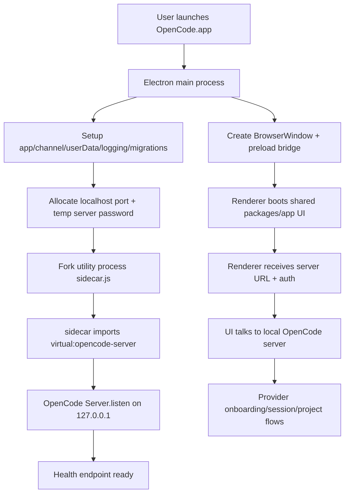
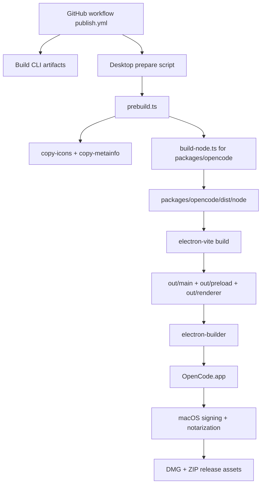

# OpenCode Desktop Specification (Current `dev` Implementation)

- Status: draft
- Date: 2026-07-15
- Scope: implementation specification based on repository inspection (no runtime execution in this document)
- Repository: `anomalyco/opencode`
- Branch/commit analyzed: `dev` @ `571e7b852f82415faf65466e1536357a048bdf5a`

## 1) Purpose

This specification captures how OpenCode Desktop is currently implemented on the `dev` branch, with explicit answers to:

1. whether `packages/app` is shared across browser/desktop/CLI,
2. whether Desktop runs on a fresh machine without preinstalled OpenCode CLI,
3. what installation/build steps ensure Desktop startup, what is bundled in `.dmg`,
4. and how the desktop update routine works when a new version is available.

It also records confirmed behavior, intended behavior, and current gaps.

## 2) Direct answers to requested questions

### Q1. Is `packages/app` shared by web browser, desktop and CLI usage?

Short answer:

- **Browser:** yes, directly.
- **Electron desktop:** yes, directly.
- **CLI/TUI terminal:** no, not directly.

Details:

- Browser entry point uses `packages/app` directly: `packages/app/src/entry.tsx`.
- Desktop renderer uses `packages/app` directly: `packages/desktop/src/renderer/index.tsx`.
- Terminal interface is a separate package (`packages/tui`), consumed by CLI/opencode packages, not by `packages/app`.
- `packages/opencode` build can compile/embed web UI assets from `packages/app` at build time (`packages/opencode/script/build.ts`), but terminal TUI runtime remains separate.

### Q2. Can OpenCode Desktop run on a fresh computer without OpenCode CLI preinstalled?

**Yes** for Desktop runtime startup.

Desktop starts a bundled local OpenCode server through an Electron utility process sidecar (`packages/desktop/src/main/sidecar.ts`) by importing `virtual:opencode-server`, resolved to `packages/opencode/dist/node.js` (`packages/desktop/electron.vite.config.ts`).

Fresh device does not require preinstalled:

- OpenCode CLI
- Bun
- Node.js
- Rust
- package manager

Those are build/development concerns, not end-user startup prerequisites.

### Q3. What scripts/install steps ensure Desktop runs, and are components bundled in `.dmg`?

For production artifacts, Desktop is packaged as an Electron app and is intended to be self-contained.

Build/package path (high level):

1. Desktop prepare script runs (`packages/desktop/scripts/prepare.ts`) and triggers `prebuild.ts`.
2. `prebuild.ts` copies resources and builds OpenCode Node server bundle (`packages/opencode/script/build-node.ts`).
3. Electron Vite builds `main`, `preload`, `renderer`, and includes sidecar entry (`packages/desktop/electron.vite.config.ts`).
4. Electron Builder packages app (`packages/desktop/electron-builder.config.ts`) with `files: ["out/**/*", "resources/**/*"]` and selected `native/` extra resources.
5. macOS outputs: `dmg` and `zip`; signing/notarization configured in builder and release workflow.

Bundled baseline in `.app`/`.dmg`:

- Electron runtime (Chromium + Node runtime)
- Desktop main/preload/renderer outputs
- Shared app UI assets used by desktop renderer
- Sidecar entry
- OpenCode server JS bundle (`dist/node`) and copied server wasm assets
- packaged desktop resources/icons

Known uncertainty/gap:

- The codebase contains a CLI install surface (`install-cli`) and helper to copy `resources/opencode-cli`, but current `dev` inspection did not find a complete wiring path proving that `resources/opencode-cli` is always created and installed from desktop.

## 3) System architecture

### 3.1 Runtime architecture (clean machine)

### 3.2 Build/package architecture

## 4) Component boundaries

### 4.1 Shared vs desktop-only

Shared OpenCode domain behavior (server/runtime level):

- provider auth model and provider APIs
- sessions/projects/state logic
- auth file handling (`Global.Path.data/auth.json`)
- MCP/auth data structures

Desktop-only behavior:

- native windowing and restoration
- deep-link protocol registration (`opencode://`)
- Electron preload API bridge
- updater orchestration in main process
- native pickers/clipboard/notifications integration
- WSL orchestration on Windows

### 4.2 `packages/app` usage model

- Browser app and desktop renderer share `AppInterface` and related app-level contexts/hooks.
- Terminal path is `packages/tui` (OpenTUI-based), not `packages/app`.

## 5) Installation and first-launch routine

### 5.1 Artifact targets

Configured in `packages/desktop/electron-builder.config.ts`:

- macOS: `dmg`, `zip`
- Windows: `nsis`
- Linux: `AppImage`, `deb`, `rpm`

### 5.2 First launch routine

From desktop main process (`packages/desktop/src/main/index.ts`) and server startup (`packages/desktop/src/main/server.ts`, `packages/desktop/src/main/sidecar.ts`):

1. initialize app identity/channel and user data paths,
2. initialize logging/crash reporting/migration,
3. start local sidecar server with generated credentials,
4. wait for health,
5. initialize renderer and connect to server,
6. run onboarding checks and default project bootstrap where eligible.

Provider onboarding is user-driven through shared settings/provider dialogs in `packages/app` and writes auth data via server auth layer.

## 6) Update routine (new version available)

### 6.1 Release/update publication side

Release workflow: `.github/workflows/publish.yml`

- builds platform artifacts,
- signs/notarizes where required,
- publishes channel assets,
- prepares update metadata files (`latest*.yml`) including merge/finalization via `packages/desktop/scripts/finalize-latest-yml.ts`.

### 6.2 Client-side updater side

Updater logic: `packages/desktop/src/main/updater.ts` and integration in `packages/desktop/src/main/index.ts`.

Routine:

1. Desktop starts updater during app boot.
2. Desktop checks for updates at startup and periodically (10-minute interval in main process).
3. If update metadata indicates newer version, updater transitions state and download/install flow is orchestrated through desktop updater controller/preload APIs.
4. Before applying update, desktop stops sidecar/server processes.
5. Desktop applies update (`quitAndInstall`) and relaunches into new version.

Operational characteristics reflected in current implementation:

- updater uses channel/repository configuration from desktop constants + builder config,
- update checks are periodic,
- install is explicitly coordinated by desktop app lifecycle.

## 7) Confirmed vs intended vs gap classification

### Confirmed

- Electron architecture with main/preload/renderer + utility-process sidecar.
- Desktop runtime can start without preinstalled standalone CLI.
- `packages/app` shared by browser + desktop.
- Terminal/TUI path uses `packages/tui`.
- Packaging includes `out/**/*` and `resources/**/*`; macOS signing/notarization configured.
- Updater routine exists and runs periodic checks from desktop main process.

### Intended (but not fully proven in current `dev` source wiring)

- Desktop flow to install a standalone terminal `opencode` CLI command from desktop UI.

### Current gaps / uncertainties

- `install-cli` preload/renderer surface exists, but current `dev` inspection did not find matching complete main IPC handler + end-to-end packaging wiring evidence.
- helper for copying CLI into `resources/opencode-cli` exists, but call path is not clearly wired in current inspected source.

## 8) Specification requirements for reliable Desktop + CLI onboarding

To guarantee a fresh device gets both Desktop runtime and terminal `opencode` command, implementation should satisfy:

1. deterministic build step that places correct platform CLI binary into packaged resources,
2. explicit `install-cli` main-process handler with path/link strategy per OS,
3. first-run verification check for CLI installability and post-install validation (`opencode --version`),
4. clear user-facing status/error messages when CLI install cannot complete,
5. integration test in release pipeline proving desktop artifact includes expected CLI payload and that install action succeeds on clean machine.

## 9) References (GitHub source)

Core desktop package and build:

- <https://github.com/anomalyco/opencode/tree/dev/packages/desktop>
- <https://github.com/anomalyco/opencode/blob/dev/packages/desktop/package.json>
- <https://github.com/anomalyco/opencode/blob/dev/packages/desktop/electron.vite.config.ts>
- <https://github.com/anomalyco/opencode/blob/dev/packages/desktop/electron-builder.config.ts>

Desktop runtime implementation:

- <https://github.com/anomalyco/opencode/blob/dev/packages/desktop/src/main/index.ts>
- <https://github.com/anomalyco/opencode/blob/dev/packages/desktop/src/main/server.ts>
- <https://github.com/anomalyco/opencode/blob/dev/packages/desktop/src/main/sidecar.ts>
- <https://github.com/anomalyco/opencode/blob/dev/packages/desktop/src/main/ipc.ts>
- <https://github.com/anomalyco/opencode/blob/dev/packages/desktop/src/preload/index.ts>
- <https://github.com/anomalyco/opencode/blob/dev/packages/desktop/src/renderer/index.tsx>
- <https://github.com/anomalyco/opencode/blob/dev/packages/desktop/src/renderer/cli.ts>

Shared app and TUI boundaries:

- <https://github.com/anomalyco/opencode/tree/dev/packages/app>
- <https://github.com/anomalyco/opencode/blob/dev/packages/app/src/entry.tsx>
- <https://github.com/anomalyco/opencode/blob/dev/packages/app/src/index.ts>
- <https://github.com/anomalyco/opencode/tree/dev/packages/tui>
- <https://github.com/anomalyco/opencode/blob/dev/packages/tui/package.json>

OpenCode server/auth/build:

- <https://github.com/anomalyco/opencode/tree/dev/packages/opencode>
- <https://github.com/anomalyco/opencode/blob/dev/packages/opencode/script/build-node.ts>
- <https://github.com/anomalyco/opencode/blob/dev/packages/opencode/script/build.ts>
- <https://github.com/anomalyco/opencode/blob/dev/packages/opencode/src/auth/index.ts>
- <https://github.com/anomalyco/opencode/blob/dev/packages/opencode/src/node.ts>

Release/update pipeline:

- <https://github.com/anomalyco/opencode/blob/dev/.github/workflows/publish.yml>
- <https://github.com/anomalyco/opencode/blob/dev/packages/desktop/src/main/updater.ts>
- <https://github.com/anomalyco/opencode/blob/dev/packages/desktop/scripts/finalize-latest-yml.ts>

CLI artifact helper and related scripts:

- <https://github.com/anomalyco/opencode/blob/dev/packages/desktop/scripts/utils.ts>
- <https://github.com/anomalyco/opencode/blob/dev/packages/desktop/scripts/prepare.ts>
- <https://github.com/anomalyco/opencode/blob/dev/packages/desktop/scripts/prebuild.ts>
